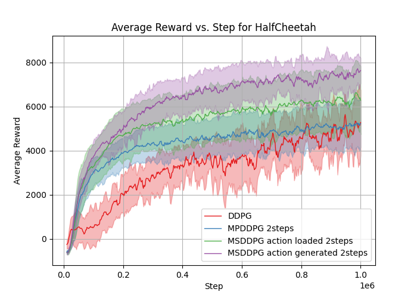
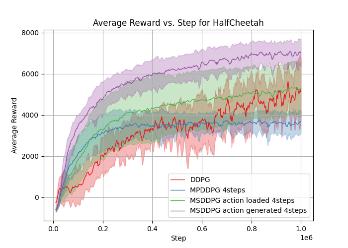
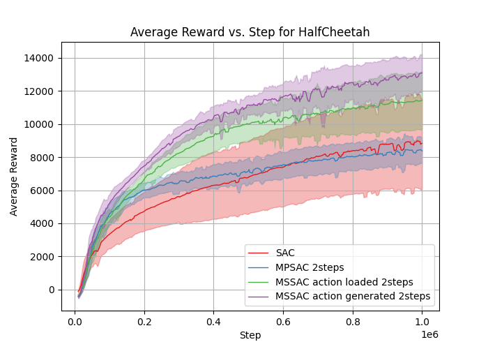
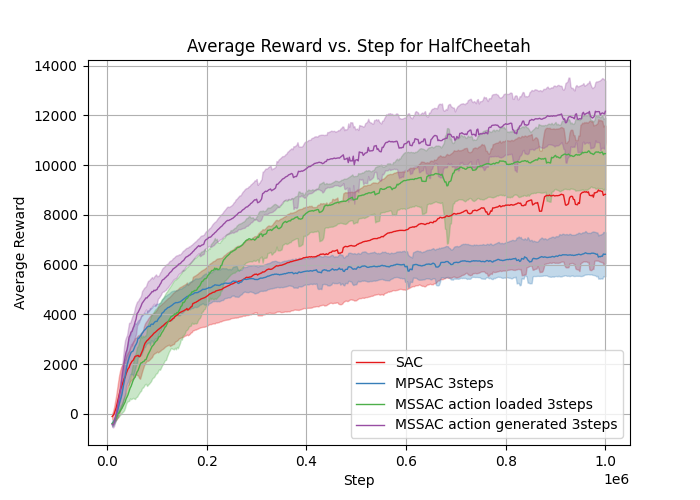
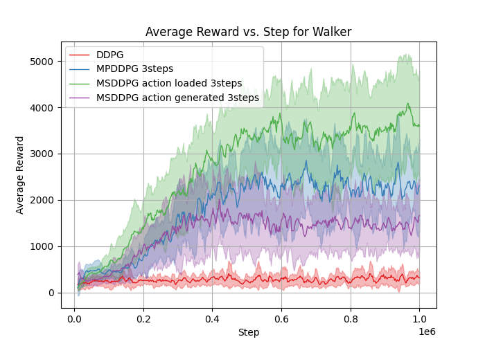
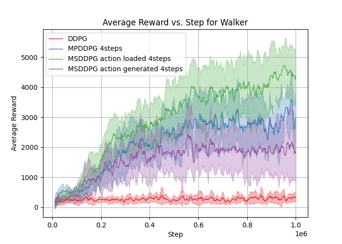
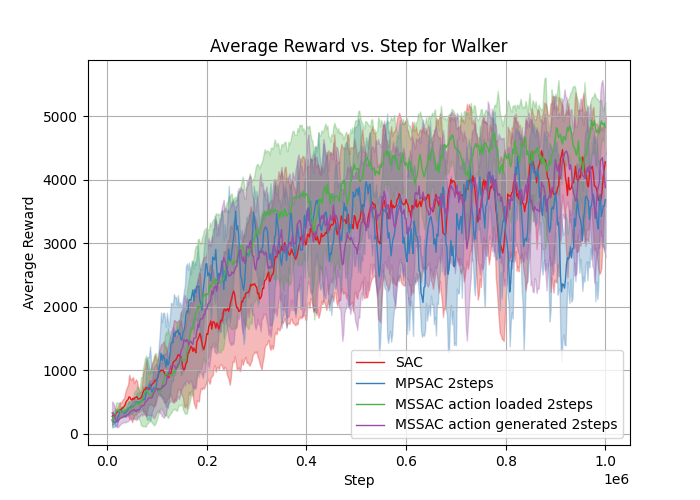
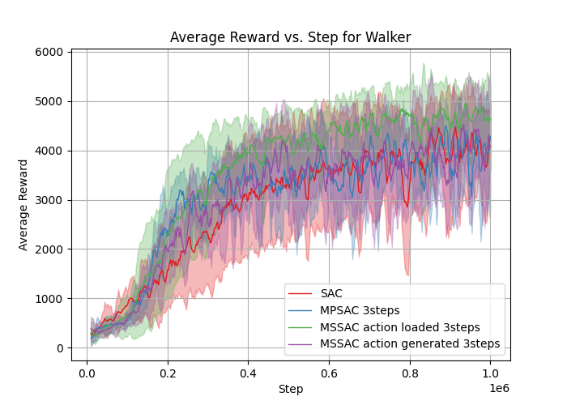
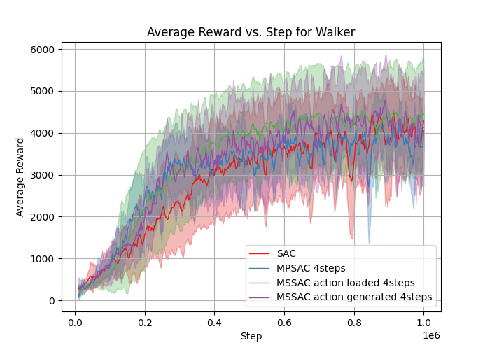

# Multi-State-TD-Target-for-Model-Free-Reinforcement-Learning
Implementation for the paper [Multi-State TD Target for Model-Free Reinforcement Learning](https://arxiv.org/abs/2405.16522)

Each py file can be run individually and we believe this setting can help readers better understand the code structure and match the code with the discription in the paper.
<table>
  <tr>
    <td></td>
    <td></td>
    <td></td>
  </tr>
  <tr>
    <td></td>
    <td></td>
    <td></td>
  </tr>
  <tr>
    <td></td>
    <td></td>
    <td></td>
  </tr>
  <tr>
    <td></td>
    <td></td>
    <td></td>
  </tr>
</table>
